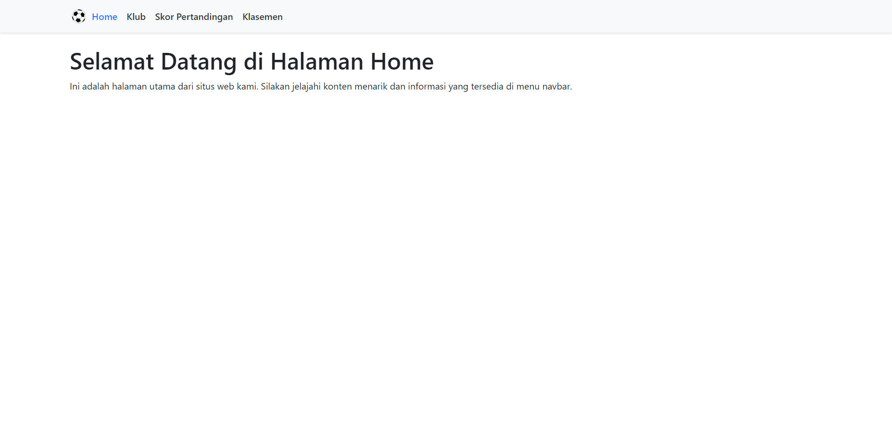
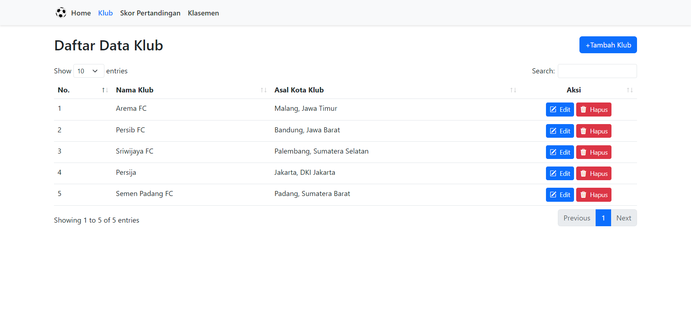
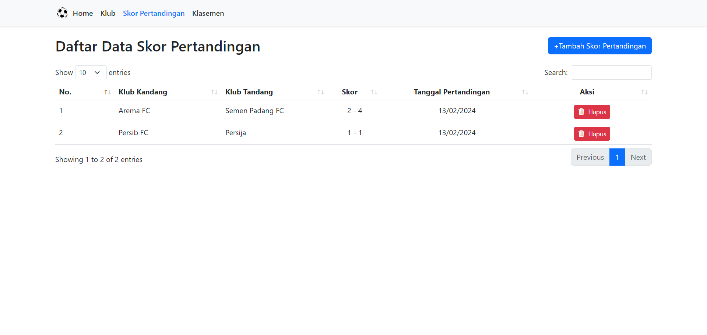
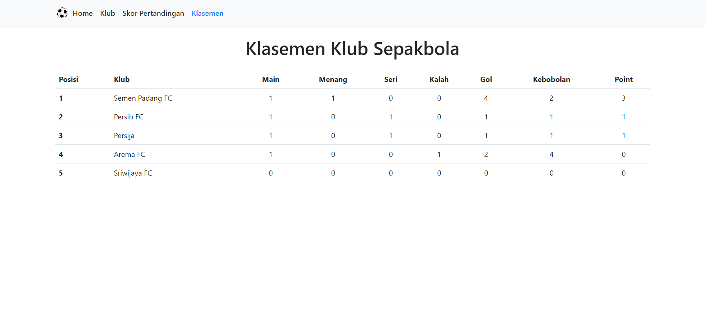

Mini Projek Kasus Klasemen Sepak Bola
======================================

Proyek ini adalah aplikasi sederhana yang dibangun menggunakan framework CodeIgniter 3 untuk mengelola klasemen sepak bola. Aplikasi ini memiliki tiga fitur utama: Klub, Skor Pertandingan, dan Klasemen.
Untuk melihat demo dari aplikasi bisa dilihat di https://rsudiu.xyz/aptavis-bola/

Fitur
-----

1. **Klub**: 

   - Fitur ini memungkinkan pengguna untuk melihat daftar klub yang terlibat dalam turnamen atau liga tertentu. Pengguna dapat menambahkan klub baru, mengedit klub, atau menghapus klub.
   - Untuk melihat daftar klub yang tersedia, navigasi ke halaman "Klub".
   - Pengguna tidak dapat menambah atau mengedit klub dengan nama yang sudah ada sebelumnya.

2. **Skor Pertandingan**: 

   - Fitur ini memungkinkan pengguna untuk mencatat skor pertandingan antara dua klub. Pengguna dapat memasukkan hasil pertandingan, seperti skor akhir pertandingan.
   - Input skor pertandingan bisa berupa multiple atau single input.
   - Pengguna tidak dapat memasukkan data pertandingan yang sudah terjadi sebelumnya, data pertandingan dari tim yang sama, atau pengulangan 2x input data yang sama.

3. **Klasemen**: 

   - Fitur ini menampilkan klasemen aktual berdasarkan hasil pertandingan yang dimasukkan oleh pengguna. Pengguna dapat melihat peringkat klub, jumlah poin, serta statistik lainnya seperti jumlah pertandingan dimainkan, menang, seri, dan kalah.

Cara Menggunakan Aplikasi
--------------------------

1. **Klub**:

   - Untuk melihat daftar klub, navigasi ke halaman "Klub".
   - Untuk menambahkan klub baru, klik tombol "Tambah Klub" dan isi formulir yang diberikan.
   - Untuk mengedit detail klub, klik tombol "Edit" di samping klub yang ingin diedit.
   - Untuk menghapus klub, klik tombol "Hapus" di samping klub yang ingin dihapus.

2. **Skor Pertandingan**:

   - Untuk mencatat skor pertandingan, navigasi ke halaman "Skor Pertandingan".
   - Isi formulir dengan detail pertandingan, seperti klub yang bertanding, dan skor pertandingan.
   - Klik tombol "Simpan" untuk menyimpan skor pertandingan.

3. **Klasemen**:

   - Navigasi ke halaman "Klasemen" untuk melihat klasemen aktual.
   - Klasemen akan otomatis diperbarui setelah Anda mencatat skor pertandingan baru.

Instalasi
----------

Untuk menjalankan proyek ini secara lokal, ikuti langkah-langkah berikut:

1. Pastikan Anda memiliki lingkungan pengembangan PHP dan MySQL yang sudah terinstal.
2. Clone repositori ini ke direktori lokal Anda.
3. Buatlah database baru dengan nama "bola", dan import file .sql dari folder database.
4. Jika Anda menggunakan XAMPP untuk local server, cukup hidupkan XAMPP dan buka browser kemudian akses http://localhost/aptavis-bola/.

Selamat menggunakan aplikasi Mini Projek Kasus Klasemen Sepak Bola! Jika Anda memiliki pertanyaan atau masalah, jangan ragu untuk menghubungi saya melalui WhatsApp di 083171027946.
